## Part 1. Готовый докер
#### Качаем образ nginx
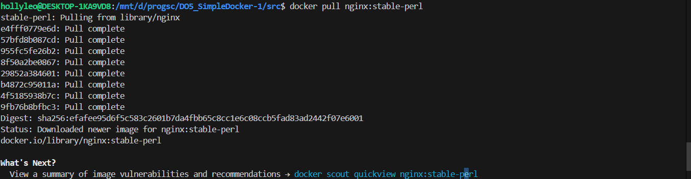
#### Проверяем наличие образа
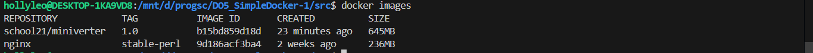
#### Запускаем docker образ
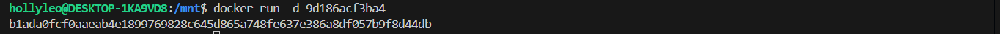
#### Проверяем запуск
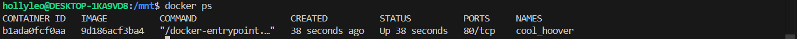
#### Размер контейнера
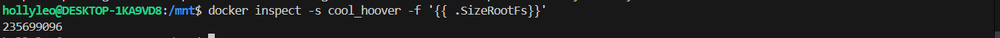
#### Список замапленных портов
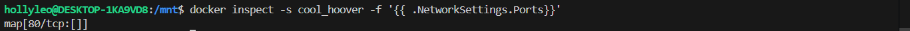
#### Ip адрес

#### Останавливаем контейнер и проверяем что он остановлен
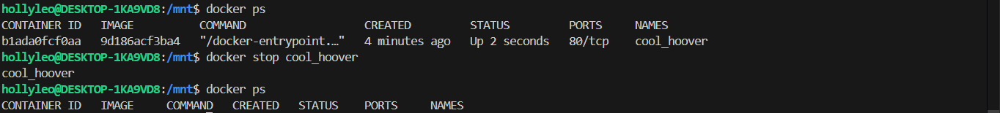
#### Запускаем докер с портами 80 и 443 в контейнере, замапленными на такие же порты на локальной машине

#### Видим стартовую страницу nginx по адресу localhost:80
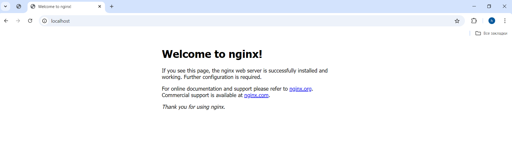
#### Перезапускаем контейнер и видим что он в работе
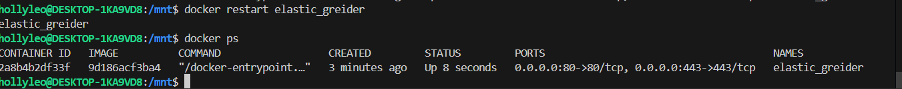
## Part 2. Операции с контейнером
#### Читаем файл nginx.conf в контейнере
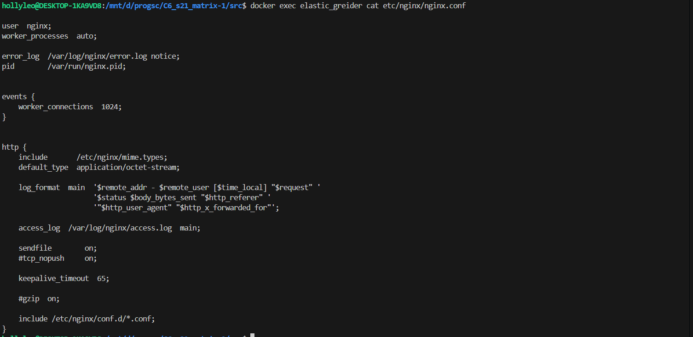
#### Создаём файл nginx.conf на локальной машине, вставляем, то что скопировали с файла в контейнере, изменяем его
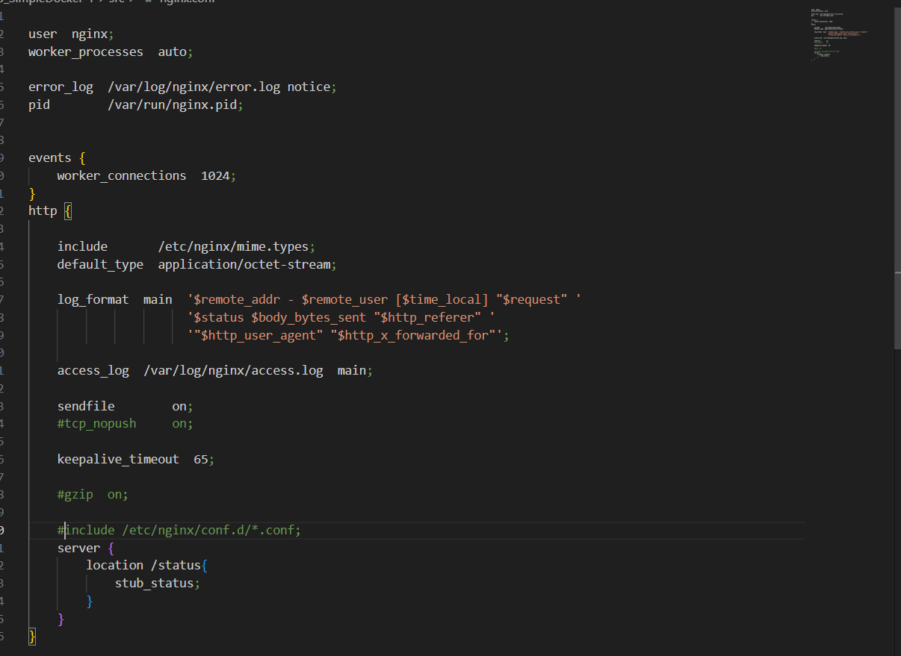
#### Здесь мы комментируем include и добавляем блок server с блоком location
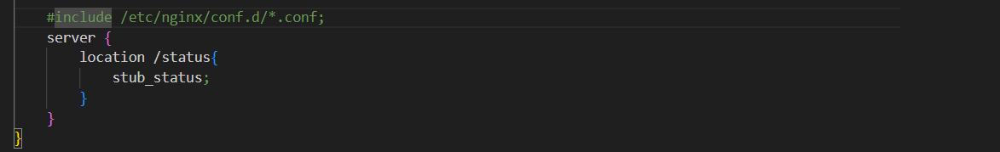 
#### Копируем созданный на локальной машине файл nginx.conf в контейнер
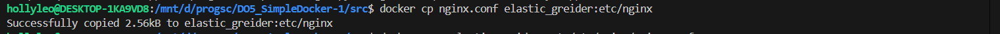
#### Перезапускаем настройки nginx 
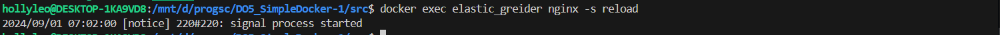
#### Как видим, добавились нужные нам строчки
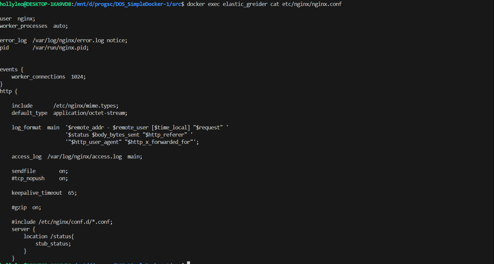
#### Проверяем страницу по адресу localhost/status
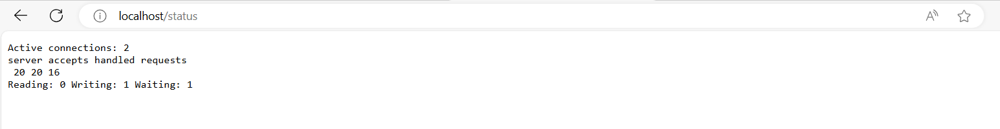
#### Экспортируем контейнер в файл container.tar
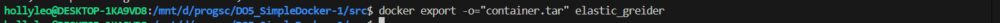
#### Он появился в директории, в которой на данный момент мы находимся
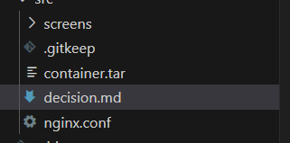
#### Останавливаем контейнер
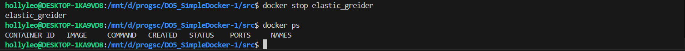
#### Удаляем образ используя опцию -f
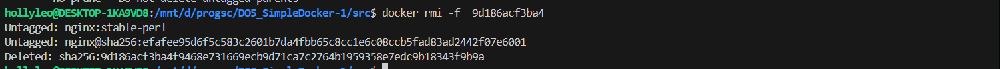
#### Удаляем контейнер
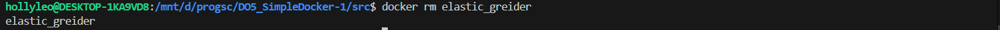
#### Импортируем контейнер
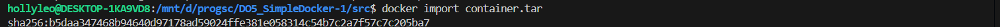
#### Как видим на скрине, команда docker import создаёт image из архива tar
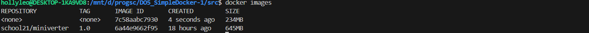
#### Создаём и запускаем контейнер с полученного образа
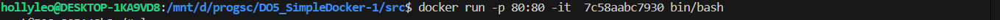
#### Запускаем внутри контейнера nginx
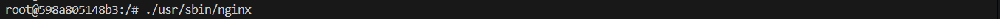
#### Видим что по адресу localhost/status получаем страницу со статусом nginx
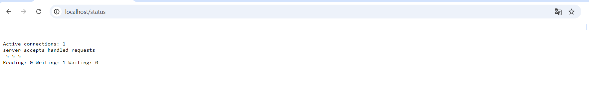

## Part 3. Мини веб-сервер
#### Пишем мини сервер fcgi
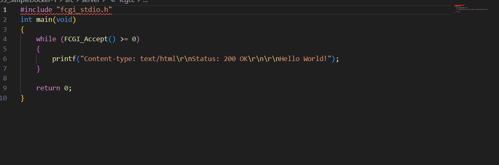
#### Устанавливаем библиотеку fcgi,  утилиту spawn-fcgi, и nginx `apt-get install libfcgi-dev` и `apt-get install spawn-fcgi` `apt-get install nginx`
#### Компилируем `fcgi.c`
#### Запускаем сервер командой `spawn-fcgi -p 8080 fcgi`
#### Создаём nginx.conf со следующими данными
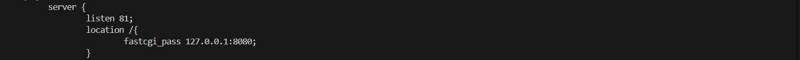
#### Указываем,что используем собственную настройку nginx `nginx -с` и путь до nginx.conf
#### Видим страничку
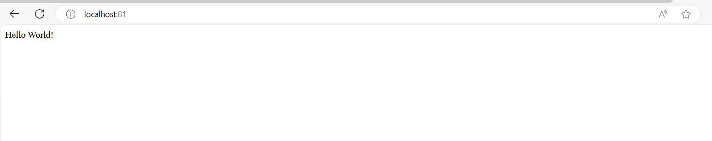

## Part 4. Свой докер
#### Создаём dockerfile
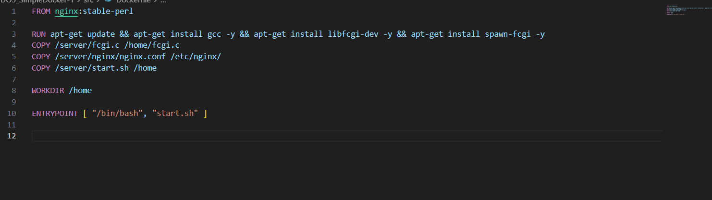
#### Создаём image командой `docker build -t school:21 .` находясь в директории с Dockerfile
#### Смотрим образы командой `docker images`

#### В директорию `src/server/nginx` копируем все конфиги с локального nginx кроме созданного в part 3 nginx.conf
#### Создаём и запускаем контейнер через наш image с маппингом порта 80 на локальном хосте, 81 в контейнере и маппингом папок ./server/nginx в папку /etc/nginx в контейнере, чтобы настройки контейнер брал с нашего локального хоста
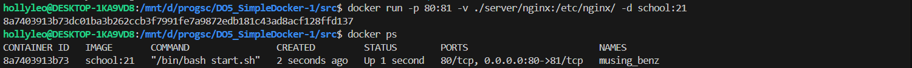
#### Видим вывод нашего fcgi сервера
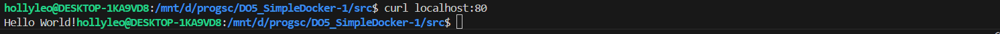
#### Добавляем в ./server/nginx/nginx.conf настройки вывода статуса
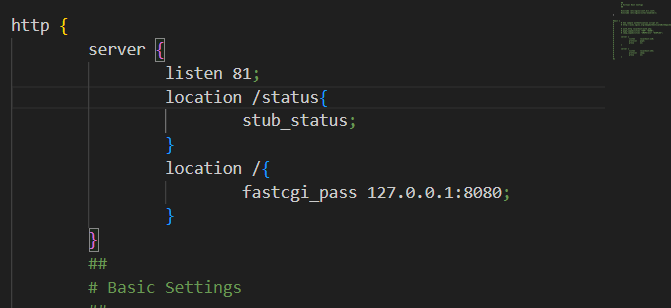
#### Перезапускаем контейнер и проверяем вывод статуса
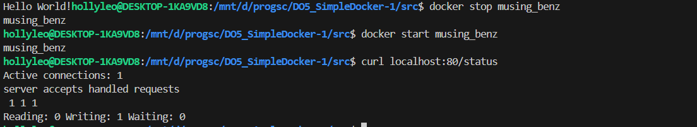
## Part 5. Dockle
#### Устанавливаем dockle
```bash
VERSION=$(
 curl --silent "https://api.github.com/repos/goodwithtech/dockle/releases/latest" | \
 grep '"tag_name":' | \
 sed -E 's/.*"v([^"]+)".*/\1/' \
) && curl -L -o dockle.deb https://github.com/goodwithtech/dockle/releases/download/v${VERSION}/dockle_${VERSION}_Linux-64bit.deb
$ sudo dpkg -i dockle.deb && rm dockle.deb
```
#### При скане образа созданного с помощью докерфайла из part 4, наблюдаем следующие ошибки
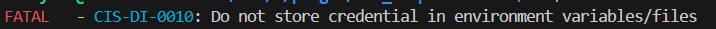
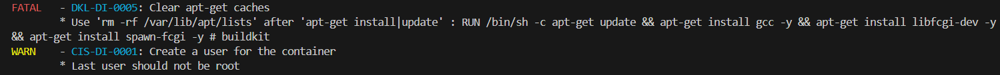
#### Создаём новый dockerfile
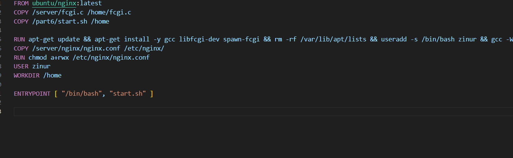
##### Для исправления ошибки CIS-DI-0010 берём другую версию образа, в нашем случае это образ ubuntu/nginx. Для исправления ошибки DKL-DI-0005 удаляем cache, что и указано в подсказке с dockle. Для устранения warning CIS-DI-0001, создаём пользователя и разрешаем пользователям использовать файлы, связанные с execute nginx и конфиг файлы nginx
#### Создаём новый скрипт, который будет запускать наш пользователь
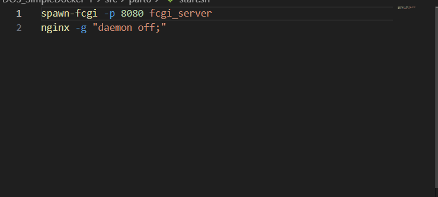
#### Билдим образ
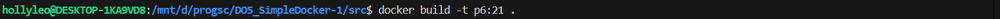
#### Запускаем контейнер и проверяем работоспособность его
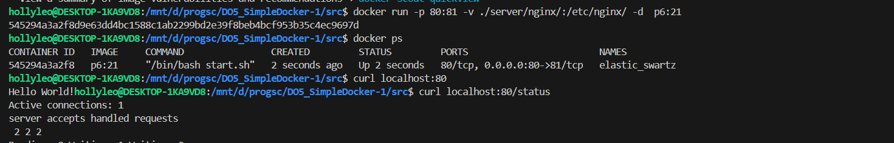
#### Проверяем на ошибки в dockle
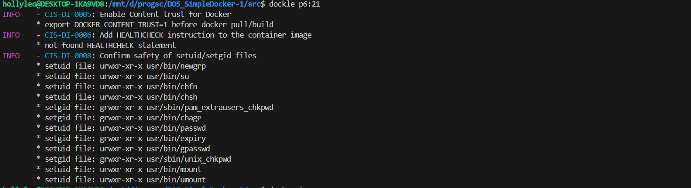
## Part 6. Базовый Docker Compose
#### Создаём файл `docker-compose.yml`
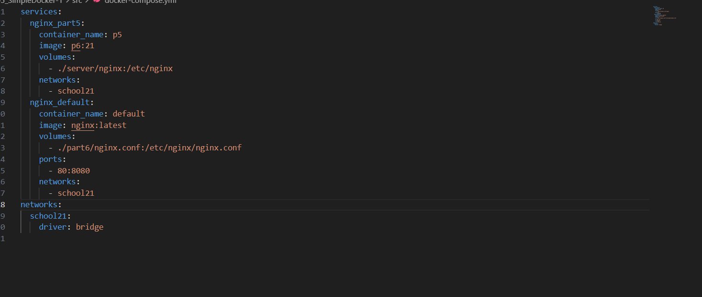
##### В контейнере nginx_part5 мы задаём image который будем использовать, указываем volume и сеть, в которой будут общаться наши контейнеры. В контейнере nginx_default делаем тоже самое, только пробрасываем порт контейнера (8080), на порт локального хоста (80) и создаём новый кфг, где указываем настройки проксирования
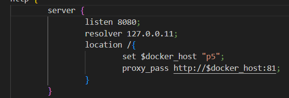
##### Устанавливаем порт 8080 для сервера, в resolver указываем ip dns докера, и задаём переменной docker_host , hostname нашего контейнера, в который нужно проксировать запросы
#### Проверяем работоспособность контейнеров
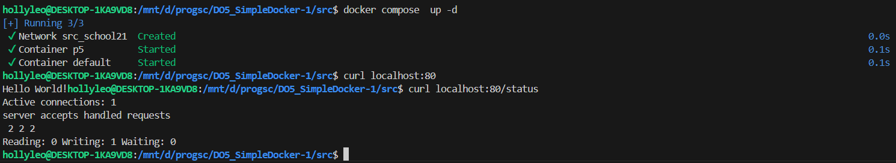


