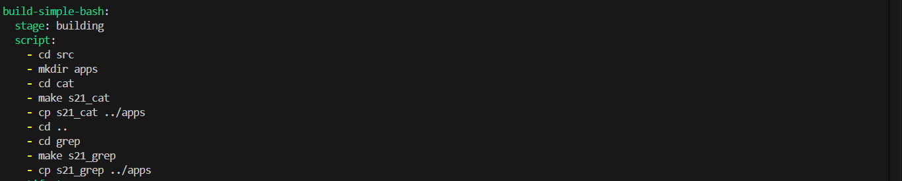
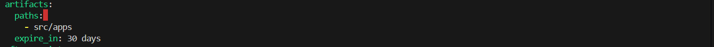
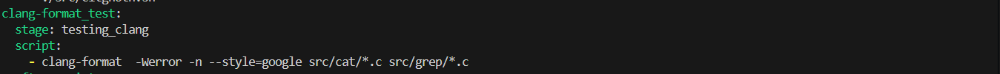
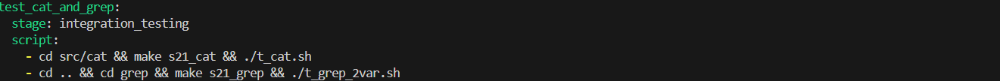
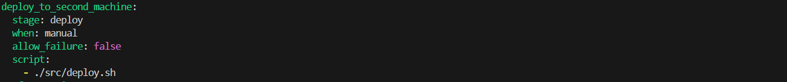
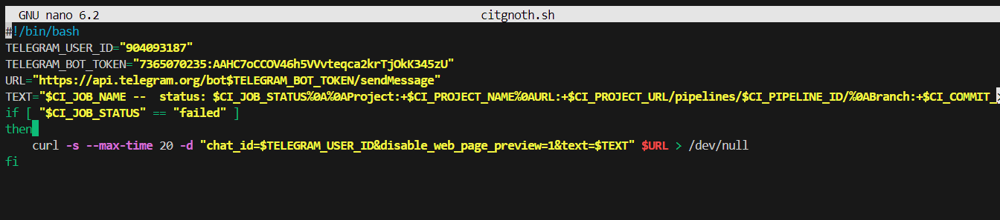
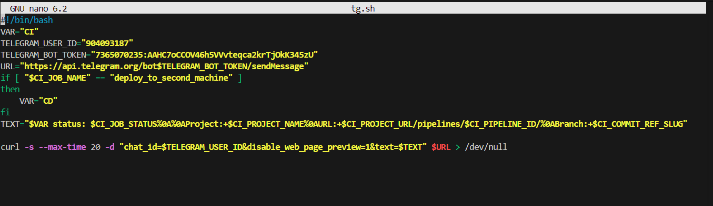
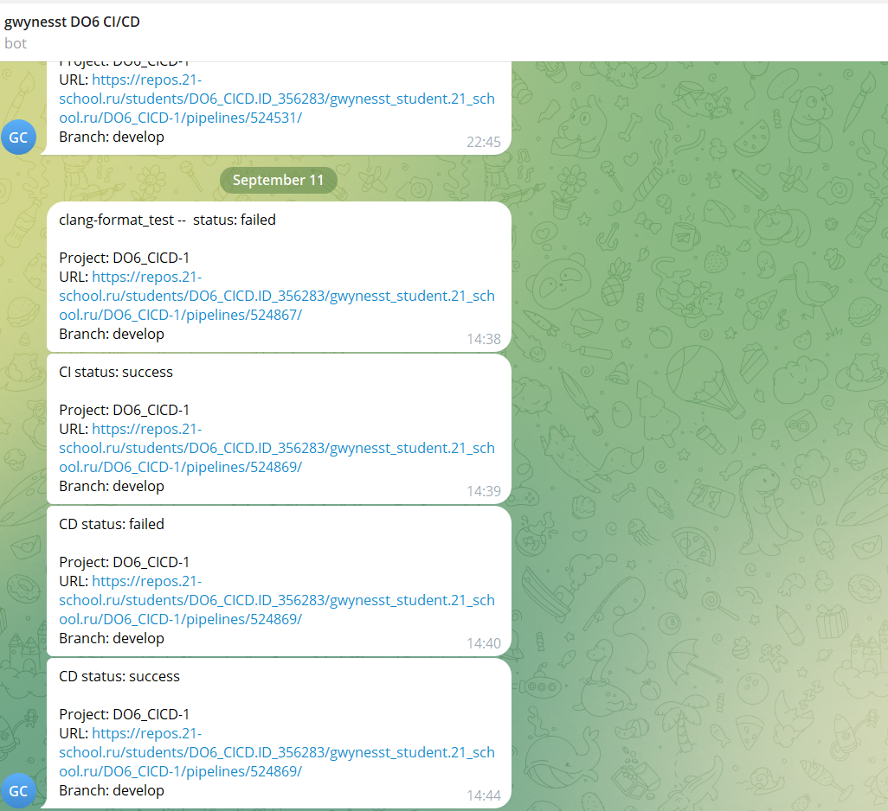

## Part 1. Настройка gitlab-runner
#### Устанавливаем gitlab-runner командой для убунты
#### Качаем файлы 
`curl -LJO "https://s3.dualstack.us-east-1.amazonaws.com/gitlab-runner-downloads/latest/deb/gitlab-runner_${arch}.deb"`
#### Устанавливаем
`dpkg -i gitlab-runner_<arch>.deb`
#### Регистрируемся командой
`sudo gitlab-runner register`
## Part 2. Сборка
#### Создаём файл .gitlab-ci.yml, который будет использоваться gitlab-runnerом, где пишем скрипт билда проекта simple bash

#### Сохраняем в произвольную директорию со сроком хранения 30 дней.

## Part 3. Тест кодстайла
#### Добавляем очередной job в наш .gitlab-ci.yml

##### Флаг Werror при любом не соответсвие вернет код ошибки, который и зафейлит pipeline
## Part 4. Интеграционные тесты
#### Добавляем job с запуском тестов cat и grep, предварительно разрешив всем юзерам execute тесты командой `chmod a+x arg`

##### Одна ошибка полученная на тесте car или grep, зафейлит pipeline
## Part 5. Этап деплоя
#### Поднимаем вторую машину, в ней сразу даём права на запись в директорию /usr/local/bin `chmod a+rwx /usr/local/bin`, ставим её в одну локальную сеть, для связи с первой машиной.
#### В первой машине ставим пароль gitlab-runner при помощи `passwd`, заходим под ним при помощи `su - gitlab-runner`, генерируем ssh ключ командой `ssh-keygen` и отправляем публичный ключ на сервер к которому будем подключаться командой `ssh-copy-id user@address`
#### Добавляем в .gitlab-ci.yml job deploy

#### when : manual указывает что запускаем вручную, allow_failure : false - позволяет зафейлить pipeline, при получении ошибки 
## Part 6. Дополнительно. Уведомления
#### Создаём два скрипта и бота через botfather берем оттуда id 

#### Первый скрипт используем при ошибке двух первых этапов CI, второй скрипт для последнего этапа CI и этапа CD
#### Уведомления бота
`